# NSTP Enrollment Management System (EMS) - System Diagrams & Documentation

---

## VISUAL DIAGRAMS (Interactive & Professional)

### Mermaid Diagram - System Architecture (Visual)

```mermaid
graph TB
    Admin["👤 Administrator<br/>System Manager"]
    Student["👤 Student<br/>Enrollee"]
    
    Admin -->|Access| System["🔒 NSTP ENROLLMENT SYSTEM"]
    Student -->|Access| System
    
    System --> Auth["🔐 Authentication<br/>& Authorization"]
    System --> Enroll["📝 Enrollment<br/>Management"]
    System --> Manage["📋 Student<br/>Management"]
    System --> Report["📊 Reports<br/>& Analytics"]
    
    Auth -->|Verify| DB["💾 DATA STORAGE"]
    Enroll -->|Store| DB
    Manage -->|Store| DB
    Report -->|Query| DB
    
    DB --> Users["👥 User Accounts<br/>& Credentials"]
    DB --> Students["🎓 Student Enrollment<br/>Information"]
    
    Admin -->|View Dashboard| Report
    Admin -->|Manage Records| Manage
    
    Student -->|Register| Auth
    Student -->|Enroll| Enroll
    Student -->|View Status| Report
    
    style System fill:#4A90E2,stroke:#333,color:#fff
    style Auth fill:#7ED321,stroke:#333,color:#fff
    style Enroll fill:#7ED321,stroke:#333,color:#fff
    style Manage fill:#7ED321,stroke:#333,color:#fff
    style Report fill:#7ED321,stroke:#333,color:#fff
    style DB fill:#F5A623,stroke:#333,color:#fff
    style Users fill:#BD10E0,stroke:#333,color:#fff
    style Students fill:#BD10E0,stroke:#333,color:#fff
```



---

## 1. SYSTEM ARCHITECTURE DIAGRAM (Level 0)

```
┌──────────────────────────────────────────────────────────────────┐
│                      USERS/STAKEHOLDERS                          │
├──────────────────────────────────────────────────────────────────┤
│                                                                   │
│  ┌─────────────────────────┐     ┌──────────────────────────┐   │
│  │   SYSTEM ADMINISTRATOR  │     │   STUDENT USERS          │   │
│  │                         │     │                          │   │
│  │ • View dashboard        │     │ • Register account       │   │
│  │ • Manage all students   │     │ • Enroll in NSTP         │   │
│  │ • Edit student records  │     │ • Select component       │   │
│  │ • View enrollment stats │     │ • Manage own profile     │   │
│  │ • Generate reports      │     │ • Check enrollment status│   │
│  │ • Monitor system        │     │ • Update information     │   │
│  └────────────┬────────────┘     └────────────┬─────────────┘   │
│               │                               │                 │
└───────────────┼───────────────────────────────┼─────────────────┘
                │                               │
                │     NSTP ENROLLMENT SYSTEM    │
                │                               │
┌───────────────┼───────────────────────────────┼─────────────────┐
│               ▼                               ▼                 │
│  ┌──────────────────────────────────────────────────────────┐  │
│  │        CORE SYSTEM FUNCTIONALITY                         │  │
│  │                                                          │  │
│  │  ┌──────────────────────┐  ┌─────────────────────────┐  │  │
│  │  │  AUTHENTICATION      │  │  ENROLLMENT MANAGEMENT  │  │  │
│  │  │  & AUTHORIZATION     │  │                         │  │  │
│  │  │                      │  │ • Register students     │  │  │
│  │  │ • User registration  │  │ • Add new enrollment    │  │  │
│  │  │ • Account creation   │  │ • Edit enrollment data  │  │  │
│  │  │ • Secure login       │  │ • Delete records        │  │  │
│  │  │ • Access control     │  │ • Track enrollment      │  │  │
│  │  │ • Session management │  │ • Manage components     │  │  │
│  │  │                      │  │   (ROTC/CWTS)          │  │  │
│  │  └──────────────────────┘  └─────────────────────────┘  │  │
│  │                                                          │  │
│  │  ┌──────────────────────┐  ┌─────────────────────────┐  │  │
│  │  │ STUDENT MANAGEMENT   │  │ REPORTING & ANALYTICS   │  │  │
│  │  │                      │  │                         │  │  │
│  │  │ • View student list  │  │ • Dashboard statistics  │  │  │
│  │  │ • Search students    │  │ • Enrollment reports    │  │  │
│  │  │ • Filter by course   │  │ • Component breakdown   │  │  │
│  │  │ • Filter by gender   │  │ • Course distribution   │  │  │
│  │  │ • View details       │  │ • Trend analysis        │  │  │
│  │  │ • Update profiles    │  │ • Export data           │  │  │
│  │  └──────────────────────┘  └─────────────────────────┘  │  │
│  │                                                          │  │
│  └──────────────────┬───────────────────────────────────────┘  │
│                     │                                           │
└─────────────────────┼───────────────────────────────────────────┘
                      │
                      ▼
┌──────────────────────────────────────────────────────────────────┐
│              ENROLLMENT DATA REPOSITORY                          │
├──────────────────────────────────────────────────────────────────┤
│                                                                   │
│  ┌──────────────────────────┐  ┌──────────────────────────┐     │
│  │    USER ACCOUNTS         │  │  STUDENT ENROLLMENT      │     │
│  │                          │  │  INFORMATION             │     │
│  │ • Account ID             │  │                          │     │
│  │ • Name                   │  │ • Enrollment ID          │     │
│  │ • Email address          │  │ • Linked user account    │     │
│  │ • Password (secured)     │  │ • Chosen NSTP component  │     │
│  │ • User role (admin/std)  │  │ • Course/program         │     │
│  │ • Login history          │  │ • Year level             │     │
│  │                          │  │ • Gender                 │     │
│  │                          │  │ • Date of birth          │     │
│  │                          │  │ • Home address           │     │
│  │                          │  │ • Religion               │     │
│  │                          │  │ • Enrollment date        │     │
│  └──────────────────────────┘  └──────────────────────────┘     │
│                                                                   │
└──────────────────────────────────────────────────────────────────┘
```

**Key System Components:**
- **Users**: System Administrators and Student Users accessing the platform
- **Core Functions**: Authentication, Enrollment Management, Student Management, Reporting
- **Data Storage**: Secure repository for user accounts and enrollment information
- **System Purpose**: Centralized management and tracking of NSTP student enrollment

---

## 2. DATA FLOW DIAGRAM (DFD) - Level 0 (Context Diagram)

### Mermaid Diagram - Data Flow (Visual)

```mermaid
graph LR
    Admin["👤 Admin User<br/>Dashboard & Reports"]
    Student["👤 Student User<br/>Enrollment & Status"]
    
    Admin -->|Request Data| System["🔄 ENROLLMENT SYSTEM<br/>Processing"]
    Student -->|Request Services| System
    
    System -->|Provide Reports| Admin
    System -->|Provide Status| Student
    
    System --> P1["Process 1<br/>Authentication"]
    System --> P2["Process 2<br/>Enrollment"]
    System --> P3["Process 3<br/>Management"]
    System --> P4["Process 4<br/>Reporting"]
    
    P1 --> Store1["💾 Data Store 1<br/>User Credentials"]
    P2 --> Store2["💾 Data Store 2<br/>Student Enrollment"]
    P3 --> Store2
    P4 --> Store1
    P4 --> Store2
    
    Store1 -->|Verified Data| System
    Store2 -->|Student Data| System
    
    style System fill:#4A90E2,stroke:#333,color:#fff,stroke-width:3px
    style Admin fill:#50E3C2,stroke:#333,color:#000
    style Student fill:#50E3C2,stroke:#333,color:#000
    style P1 fill:#7ED321,stroke:#333,color:#fff
    style P2 fill:#7ED321,stroke:#333,color:#fff
    style P3 fill:#7ED321,stroke:#333,color:#fff
    style P4 fill:#7ED321,stroke:#333,color:#fff
    style Store1 fill:#F5A623,stroke:#333,color:#fff
    style Store2 fill:#F5A623,stroke:#333,color:#fff
```



**System Inputs (From Users):**
- Registration and login requests
- Enrollment applications
- Student information updates
- Administrative requests (view, edit, delete, report)

**System Processes:**
- Authenticate users and manage access
- Register new student enrollments
- Store and retrieve student information
- Generate reports and analytics
- Maintain data security

**System Outputs (To Users):**
- Login success/failure confirmation
- Enrollment confirmation and status
- Dashboard with statistics
- Student records and reports
- System notifications and feedback

**Data Stores:**
- User account database with credentials and roles
- Student enrollment database with complete enrollment details

---

## 3. USE CASE DIAGRAM

### Mermaid Diagram - Use Cases (Visual)

```mermaid
graph TB
    Admin["👤 Administrator<br/>System Manager"]
    Student["👤 Student<br/>Enrollee"]
    
    subgraph System["🎓 NSTP ENROLLMENT SYSTEM"]
        UC1["🔐 Authenticate User<br/>Login/Register"]
        UC2["📋 View Dashboard<br/>Statistics & Analytics"]
        UC3["👥 Manage Student<br/>Records"]
        UC4["📝 Search & Filter<br/>Students"]
        UC5["📊 Generate Reports<br/>& Export"]
        UC6["📋 Enroll in NSTP<br/>Component"]
        UC7["👁️ View Enrollment<br/>Status"]
        UC8["👤 Update Personal<br/>Profile"]
    end
    
    Admin -->|Uses| UC1
    Admin -->|Uses| UC2
    Admin -->|Uses| UC3
    Admin -->|Uses| UC4
    Admin -->|Uses| UC5
    
    Student -->|Uses| UC1
    Student -->|Uses| UC6
    Student -->|Uses| UC7
    Student -->|Uses| UC8
    
    UC3 -->|Requires| UC4
    UC5 -->|Requires| UC4
    UC6 -->|Requires| UC1
    UC7 -->|Requires| UC1
    UC8 -->|Requires| UC1
    
    style System fill:#E8F4F8,stroke:#333,stroke-width:3px
    style UC1 fill:#7ED321,stroke:#333,color:#fff
    style UC2 fill:#7ED321,stroke:#333,color:#fff
    style UC3 fill:#7ED321,stroke:#333,color:#fff
    style UC4 fill:#7ED321,stroke:#333,color:#fff
    style UC5 fill:#7ED321,stroke:#333,color:#fff
    style UC6 fill:#7ED321,stroke:#333,color:#fff
    style UC7 fill:#7ED321,stroke:#333,color:#fff
    style UC8 fill:#7ED321,stroke:#333,color:#fff
    style Admin fill:#50E3C2,stroke:#333,color:#000
    style Student fill:#50E3C2,stroke:#333,color:#000
```



**Primary Actors:**

1. **Administrator** - System Manager
   - Views enrollment dashboard and key statistics
   - Manages all student records
   - Generates reports and analytics
   - Controls system access and user roles

2. **Student** - Enrollee
   - Creates and manages user account
   - Authenticates securely to the system
   - Enrolls in NSTP component of choice
   - Monitors enrollment status
   - Updates personal profile information

**Key System Capabilities:**
- Authentication & Authorization
- Student Record Management
- Enrollment Processing
- Data Analysis & Reporting
- Component Selection (ROTC/CWTS)
- System Administration

---

## 4. ACTIVITY DIAGRAM - Student Enrollment Process

### Mermaid Diagram - Student Enrollment Flow (Visual)

```mermaid
stateDiagram-v2
    [*] --> AccessSystem: Student Accesses System
    
    AccessSystem --> CheckAccount: Has Account?
    
    CheckAccount -->|NO| Registration: Display Registration Page
    CheckAccount -->|YES| LoginPage: Display Login Page
    
    Registration --> EnterReg["Enter:<br/>Name, Email,<br/>Password"]
    EnterReg --> ValidateReg{Valid<br/>Data?}
    ValidateReg -->|NO| RegError["Show<br/>Validation<br/>Errors"]
    RegError --> EnterReg
    ValidateReg -->|YES| CreateAccount["Create User<br/>Account"]
    CreateAccount --> LoginPage
    
    LoginPage --> EnterCred["Enter Email<br/>& Password"]
    EnterCred --> AuthCheck{Credentials<br/>Valid?}
    AuthCheck -->|NO| LoginError["Show<br/>Login<br/>Error"]
    LoginError --> EnterCred
    AuthCheck -->|YES| CheckRole{User<br/>Role?}
    
    CheckRole -->|ADMIN| AdminDash["Admin Dashboard<br/>• View Students<br/>• Manage Records<br/>• Generate Reports"]
    AdminDash --> AdminOps["Admin Operations<br/>Search, Filter,<br/>Edit, Delete<br/>Student Records"]
    AdminOps --> [*]
    
    CheckRole -->|STUDENT| EnrollPage["Enrollment Page<br/>Select Component<br/>Fill Personal Info"]
    EnrollPage --> SelectComponent["Student Selects:<br/>ROTC or CWTS"]
    SelectComponent --> FillForm["Enter:<br/>Course, Year,<br/>Address, DOB,<br/>Gender, Religion"]
    FillForm --> ValidateData{All Data<br/>Valid?}
    ValidateData -->|NO| DataError["Show<br/>Validation<br/>Errors"]
    DataError --> FillForm
    ValidateData -->|YES| StoreData["Store Enrollment<br/>in Database"]
    StoreData --> Confirm["Display<br/>Enrollment<br/>Confirmation"]
    Confirm --> Success["✓ Successfully<br/>Enrolled<br/>Component: Selected<br/>Status: Active"]
    Success --> [*]
```

**Key System Decision Points:**
- New vs. existing user
- Valid credentials check
- User role determination (Admin/Student)
- Data validation before database storage
- Transaction success/failure handling

**Process Participants:**
- Student or Administrator initiating action
- System performing validation and authentication
- Database storing/retrieving information
- System providing feedback and confirmation

---

## 5. SEQUENCE DIAGRAM - Student Enrollment Interaction

### Mermaid Diagram - Sequence of Interactions (Visual)

```mermaid
sequenceDiagram
    participant Student as 👤 Student
    participant UI as 🖥️ User Interface
    participant System as 🔄 Enrollment System
    participant DB as 💾 Database
    
    Student->>UI: Accesses Application
    UI->>Student: Display Login Page
    Student->>UI: Enters Credentials
    
    UI->>System: Authenticate User
    System->>DB: Query User by Email
    DB-->>System: Return User Data
    
    alt Credentials Valid
        System->>System: Verify Password
        System->>DB: Retrieve User Role
        DB-->>System: Return Role (Admin/Student)
        System-->>UI: Authentication Success
    else Credentials Invalid
        System-->>UI: Authentication Failed
        UI->>Student: Show Error Message
    end
    
    alt User is STUDENT
        UI->>Student: Display Enrollment Portal
        Student->>UI: Request Enrollment Form
        UI->>Student: Display Form with Components
        
        Student->>UI: Select Component (ROTC/CWTS)
        Student->>UI: Fill Personal Information
        Student->>UI: Submit Enrollment
        
        UI->>System: Validate Enrollment Data
        alt Data Valid
            System->>DB: INSERT Enrollment Record
            DB-->>System: Confirmation
            System->>DB: INSERT Student Profile
            DB-->>System: Success
            System-->>UI: Enrollment Confirmed
            UI->>Student: Display Success & Details
        else Data Invalid
            System-->>UI: Return Validation Errors
            UI->>Student: Show Error Messages
        end
    else User is ADMIN
        UI->>Student: Display Admin Dashboard
        Student->>System: Request Student Data
        System->>DB: SELECT All Students
        DB-->>System: Return Student List
        System-->>UI: Display Students
        UI->>Student: Show Dashboard with Statistics
    end
    
    Student->>UI: Review/Confirm Information
    UI-->>Student: Display Final Confirmation
```



**Sequence of Interactions:**
1. Student accesses the system and sees login page
2. Student authenticates with email and password
3. System verifies credentials against database
4. System retrieves user role to determine access level
5. Student is directed to appropriate portal (Admin/Student)
6. Student requests enrollment form
7. System displays enrollment form with component options
8. Student selects component (ROTC/CWTS) and fills in personal information
9. Student submits enrollment data
10. System validates all required information is complete
11. System stores enrollment record in database
12. System generates confirmation page with enrollment details
13. Student reviews and confirms enrollment
14. System displays success message with complete enrollment information

**Key System Interactions:**
- Secure user authentication
- Role-based navigation
- Real-time data validation
- Immediate database storage
- Confirmation feedback
- Optional notification system

---

## WRITTEN DESCRIPTION

### System Purpose & Overview

The **NSTP Enrollment Management System (EMS)** is a comprehensive digital solution designed to streamline the enrollment, management, and reporting of students participating in the National Service Training Program (NSTP). The system eliminates manual, paper-based processes and provides a centralized platform for:

- **Student Enrollment**: Automated registration and component selection (ROTC or CWTS)
- **Administrative Management**: Complete control over student records and system operations
- **Reporting & Analytics**: Real-time insights into enrollment statistics and trends
- **Data Security**: Secure storage and access control for sensitive student information

The system serves two primary user groups:
1. **System Administrators**: Manage all system operations, student records, and generate reports
2. **Student Users**: Register, enroll, manage profiles, and track their enrollment status

### Problems the System Solves

**Operational Challenges Without the System:**
- ❌ Manual paper-based enrollment prone to errors, data loss, and illegibility
- ❌ Difficulty tracking students across different NSTP components (ROTC/CWTS)
- ❌ Time-consuming, error-prone report generation for administrative oversight
- ❌ No centralized student database leading to data inconsistencies
- ❌ Communication gaps and delays between students and administrators
- ❌ Inability to quickly search, filter, or analyze enrollment data
- ❌ Risk of unauthorized access to sensitive student information

**Solutions Provided by the System:**
- ✅ Automated enrollment with built-in validation and error checking
- ✅ Centralized, real-time database of all student enrollments
- ✅ Instant reports with enrollment statistics by component, course, and demographics
- ✅ Secure authentication preventing unauthorized access
- ✅ Quick search and filter capabilities for student management
- ✅ Automatic role-based access control (Admin vs Student)
- ✅ Audit trail of all system transactions
- ✅ 24/7 system availability for student self-service enrollment

### Key Features & Modules

**1. Authentication & Access Control Module**
- Secure user registration with email validation and duplicate prevention
- Encrypted login system with session management
- Role-based access control separating admin and student functions
- Password security with encryption
- Automatic logout and session timeout features

**2. Student Enrollment Module**
- Digital enrollment form with guided component selection
- Collection of comprehensive student information:
  - Personal data (name, birthdate, gender, religion)
  - Academic information (course, year level)
  - Contact details (address)
  - Program selection (ROTC or CWTS)
- Real-time validation of required fields
- Confirmation feedback upon successful enrollment
- Easy enrollment status tracking for students

**3. Student Records Management Module**
- Complete student database with CRUD capabilities
- Advanced search and filtering by:
  - Course/Program
  - NSTP Component (ROTC/CWTS)
  - Gender and other demographics
- Quick access to individual student profiles
- Edit capabilities for administrative corrections
- Safe deletion with data integrity protection
- View complete enrollment history for each student

**4. Reporting & Analytics Module**
- **Dashboard Statistics**:
  - Total students enrolled
  - Component distribution (ROTC vs CWTS)
  - Course-wise enrollment breakdown
- **Analytical Capabilities**:
  - Enrollment trends analysis
  - Component popularity metrics
  - Course distribution analysis
  - Demographic reporting (gender, year level distribution)
- Export functionality for further analysis
- Real-time data refresh

**5. User Interface & Experience**
- Intuitive, user-friendly navigation
- Admin sidebar menu for quick access to all modules
- Student portal with simple enrollment flow
- Clear labeling and visual organization
- Mobile-responsive design for accessibility
- Error messages and feedback for user guidance

### System Benefits

**For Administrators:**
- Increased operational efficiency through automation
- Better visibility into enrollment metrics
- Reduced data entry time and errors
- Quick decision-making with real-time analytics
- Centralized control of all system functions
- Complete audit trail for accountability

**For Students:**
- 24/7 access to enrollment system
- No need to visit offices for paper forms
- Immediate confirmation of enrollment
- Easy profile management
- Quick status checking
- Secure personal information handling

**For the Institution:**
- Improved data quality and consistency
- Better resource planning with accurate enrollment data
- Enhanced student satisfaction through convenience
- Compliance with security and privacy standards
- Reduced administrative overhead
- Professional image with digital systems

### How the Diagrams Represent the System

**System Architecture Diagram** illustrates the complete system structure:
- Shows stakeholders (Admin and Student users) accessing the platform
- Displays core system functions organized by purpose
- Highlights data storage with two main information repositories
- Demonstrates clear separation between different system modules

**Data Flow Diagram** visualizes information movement:
- Shows how external entities (users) interact with the system
- Illustrates system processing of requests and commands
- Displays two-way data flows for queries and updates
- Demonstrates data persistence in the central repository
- Shows feedback mechanisms returning information to users

**Use Case Diagram** defines all system capabilities:
- Identifies two distinct user roles with different privileges
- Lists all major functions available to each user type
- Shows which functions are independent and which are dependent
- Demonstrates the breadth of system functionality

**Activity Diagram** traces the complete enrollment workflow:
- Shows the decision-making process for system access
- Illustrates the enrollment journey from start to finish
- Demonstrates validation and error-handling procedures
- Shows different paths for admin vs student users
- Indicates confirmation and success states

**Sequence Diagram** details interaction timing:
- Shows the chronological order of system operations
- Demonstrates data movement between user interface and backend
- Illustrates how the system validates and stores information
- Shows the response flow back to the student
- Indicates confirmation of successful operations

### System Architecture Overview

The system is built on proven technologies:
- **Presentation Layer**: Web-based interface accessible through any browser
- **Application Layer**: Server-side logic handling all business processes
- **Data Layer**: Secure relational database for persistent storage
- **Security Layer**: Encryption, validation, and access control at every level

### Conclusion

The NSTP Enrollment Management System represents a modern, efficient approach to student enrollment management. By automating previously manual processes, centralizing student data, and providing real-time analytics, the system enables both students and administrators to work more effectively. The system design prioritizes user experience, data security, and operational efficiency, making it an essential tool for any educational institution managing NSTP programs.

---

**Document Created**: December 11, 2025
**System Version**: 1.0
**Status**: Complete System Documentation
